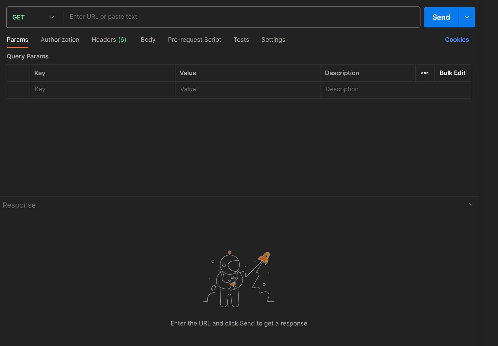
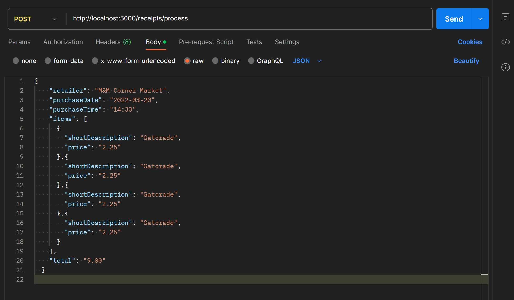
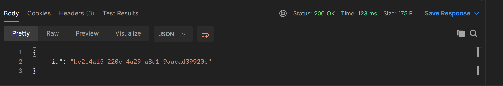
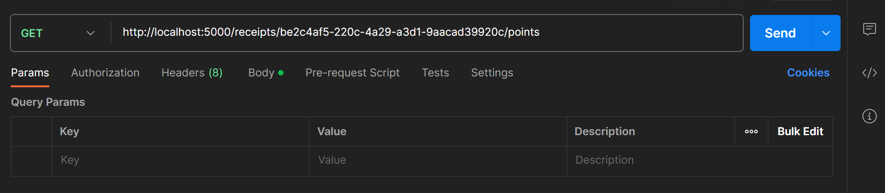
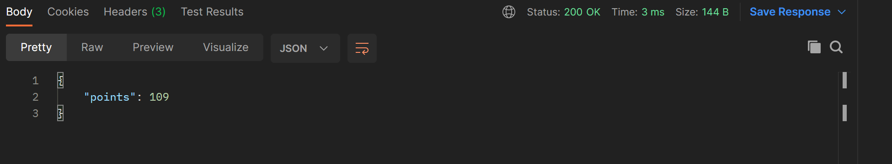

# Fetch Rewards Coding Exercise
A backend REST API web service that accepts HTTP requests and returns responses based on premise outlined below.

## Premise
* A user can submit receipts in order to earn `points` from that receipt based on specific criteria.
* Submitted receipts are stored in memory on the backend.
* Points are awarded based on the following:
    * One point for every alphanumeric character in the retailer name.
    * 50 points if the total is a round dollar amount with no cents.
    * 25 points if the total is a multiple of `0.25`.
    * 5 points for every two items on the receipt.
    * If the trimmed length of the item description is a multiple of 3, multiply the price by `0.2` and round up to the nearest integer. The result is the number of points earned.
    * 6 points if the day in the purchase date is odd.
    * 10 points if the time of purchase is after 2:00pm and before 4:00pm.

## Getting Started
1) Clone repo locally
    ```
    git clone https://github.com/tchristenson/fetch-backend-exercise.git
    ```
2) Go to the project's root directory
    ```
    cd /my/path/to/fetch-backend-exercise/src/github.com/tchristenson/app
    ```
3) Start the server
    ```
    go run .
    ```
    Your terminal should read:
    ```
    Listening and serving HTTP on localhost:5000
    ```

## Making API calls

We will be using **Postman** to make calls to the API.
* Go to the [Postman](https://www.postman.com/) site.
* Create an account or simply continue.
* From the home screen, create a new `Collection` by clicking on `Collections` in the top left menu bar, then the `+` sign. Give it a name.
* Once you're in a collection, click on `New` near the top left of the screen and select `HTTP Request`.
* Your interface should look like the image below.
>

## POST Route "/receipts/process" - Add Receipt
***REQUEST BODY FORMAT***
```
- URL: `/receipts/process`
- Method: POST
- Content Type: `application/json`
```

The request body should be a JSON object with the following structure:

```json
{
  "retailer": "string",
  "purchaseDate": "string (YYYY-MM-DD)",
  "purchaseTime": "string (HH:MM)",
  "total": "string (numeric format)",
  "items": [
    {
      "shortDescription": "string",
      "price": "string (numeric format)"
    },
    {
      "shortDescription": "string",
      "price": "string (numeric format)"
    },
    ...
  ]
}
```
* Click the dropdown that says `GET` and select `POST`.
* Enter the server port with the `/receipts/process` endpoint.
* Under the URL, select `Body`, check the `raw` radio button, and select `JSON` from the dropdown.
* Enter a valid request body in the section below, which you can copy and paste from [example.json](example.json).
* Your interface should look like the image below.
>
* Click `Send` and you should receive a `Status: 200 OK` response in the body section, plus a JSON object with the receipt's id.
>

### POST route "/receipts/process" Errors
* A `Status: 400 Bad Request` error response will occur if a request body is sent in the wrong format:
  * Missing parameters
  * A receipt with no items purchased
  * Parameters with wrong data type


## GET Route "/receipts/:receiptId/points" - Get Receipt Points
* Copy the receipt ID received from the response body of the `POST` request.
* Click the dropdown that says `POST` and select `GET`.
* Enter the server port with the `/receipts/:receiptId/points` endpoint.
* Paste the copied receiptId into the endpoint.
* Your interface should look like the image below.
>
* Click `Send` and you should receive a `Status: 200 OK` response in the body section, plus a JSON object with the receipt's points.
>

### GET route "/receipts/:receiptId/points" Errors
* A `Status: 404 Not Found` error response will occur if a receipt ID cannot be matched to a posted receipt.
